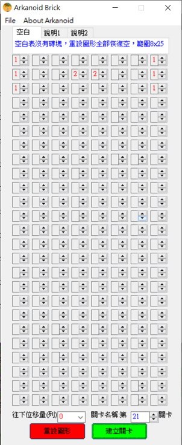
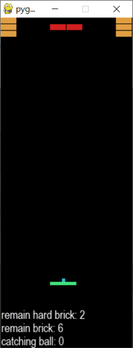
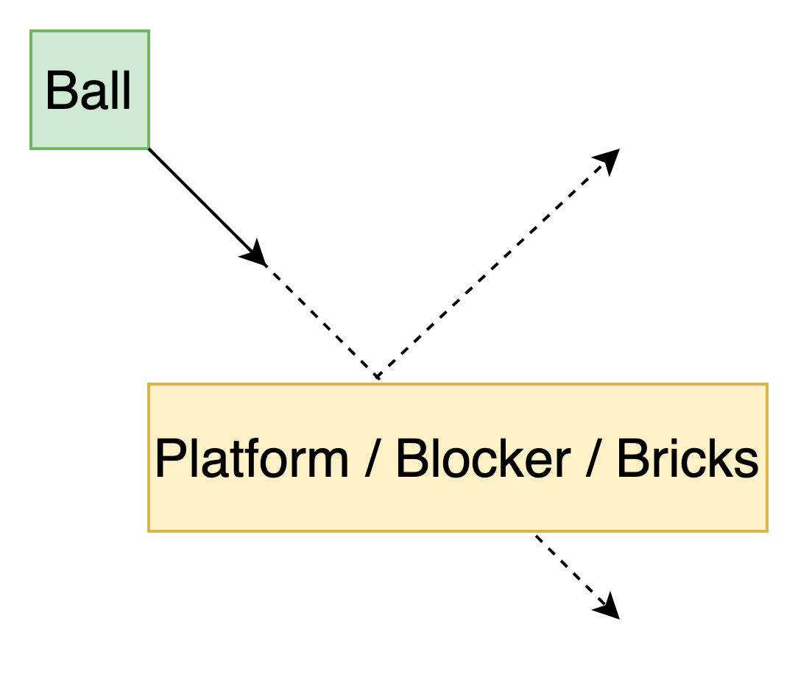

# Arkanoid 打磚塊
Finish the game using supervised learning in the class

 


[](https://www.python.org/downloads/release/python-390/)
[](https://github.com/PAIA-Playful-AI-Arena/MLGame)
[](https://github.com/pygame/pygame/releases/tag/2.0.1)

打磚塊(Arkanoid)可是世界上最古老經典遊戲之一，透過決定發球的位置與方向，嘗試接到回彈的球，逐一打掉所有磚塊。來挑戰看看如何在最短時間內擊破所有的磚塊，遊戲中還準備了各種不同的難度來讓你挑戰喔！


# 更新內容(2.3.1)
1. 更新程式碼內容，以運行於 MLGame 9.5.*以後版本

---

# **基礎介紹**

## **啟動方式**

- 直接啟動 [main.py](main.py) 即可執行

### **遊戲參數設定**

```python
# main.py 
game = Arkanoid(difficulty="EASY", level=3)
```

- `difficulty`：遊戲難度
    - `EASY`：簡單的打磚塊遊戲
    - `NORMAL`：加入切球機制
- `level`：指定關卡地圖。可以指定的關卡地圖皆在 `./asset/level_data/` 裡

## **玩法**

- 發球：左邊/右邊：A / D
- 移動板子：左右方向鍵

## **目標**

1. 破壞所有磚塊。

### **通關條件**

1. 成功摧毀所有磚塊。

### **失敗條件**

1. 沒有接到球。

## **遊戲系統**

1. 遊戲物件

    - 板子
        - 綠色長方形 寬度40,高度5
        - 每一影格的移動速度是 (±5, 0)
        - 初始位置在 (75, 400) 此數值為物件`左上角`的座標

    - 球
        - 藍色正方形 邊長5
        - 每一影格的移動速度是 (±7, ±7)
        - 球會從板子所在的位置發出，可以選擇往左或往右發球。
        - 如果在 150 影格內沒有發球，則會自動往隨機兩個方向發球
        - 初始位置在 (93, 395) 此數值為物件`左上角`的座標
    - 磚塊 
        - 橘色長方形 寬度25,高度10
        - 其位置由關卡地圖決定
    - 硬磚塊
        - 紅色長方形 寬度25,高度10
        - 硬磚塊要被打兩次才會被破壞。其被球打一次後，會變為一般磚塊。但是如果被加速後的球打到，則可以直接被破壞

2. 行動機制
    - 左右移動板子，每次移動 5px

3. 座標系統
    - 螢幕大小 200 x 500
    - 系統提供物件的座標資料，皆是物件`左上角`的座標
    - 板子 40 x 5
    - 球 5 x 5
    - 磚塊、硬磚塊 25 x 10

4. 切球機制

   球的 x 方向速度會因為接球時板子的移動方向而改變：

    - 如果板子與球的移動方向相同，則球的 x 方向速度會增為 ±10，可以一次打掉硬磚塊
    - 如果板子不動，則球的 x 方向速度會回復為 ±7
    - 如果板子與球的移動方向相反，則球會被打回原來來的方向，速度會回復為 ±7

   此機制加入在普通難度中。

---

# **進階說明**

## 使用ＡＩ玩遊戲

```bash
# 在 arkanoid 資料夾中打開終端機 
 python -m mlgame -i ./ml/ml_play_template.py . --difficulty NORMAL --level 5 
```

## ＡＩ範例

```python

class MLPlay:
    def __init__(self,ai_name, *args, **kwargs):
        """
        Constructor
        """
        print(ai_name)

    def update(self, scene_info, *args, **kwargs):
        """
        Generate the command according to the received `scene_info`.
        """
        # Make the caller to invoke `reset()` for the next round.
        if (scene_info["status"] == "GAME_OVER" or
                scene_info["status"] == "GAME_PASS"):
            return "RESET"
        if not scene_info["ball_served"]:
            command = "SERVE_TO_LEFT"
        else:
            command = "MOVE_LEFT"

        return command

    def reset(self):
        """
        Reset the status
        """
        self.ball_served = False
```

## 遊戲資訊

- scene_info 的資料格式如下

```json
{
  "frame": 0,
  "status": "GAME_ALIVE",
  "ball": [ 93, 395],
  "ball_served": false,
  "platform": [ 75, 400],
  "bricks": [
    [ 50, 60],
    ...,
    [125, 80]
  ],
  "hard_bricks": [
    [ 35, 50],
    ...,
    [135, 90]
  ]
}

```

- `frame`：遊戲畫面更新的編號
- `ball`：`(x, y)` tuple。球的位置。
- `ball_served`：`true` or `false` 布林值 boolean。表示是否已經發球。
- `platform`：`(x, y)` tuple。平台的位置。
- `bricks`：為一個 list，裡面每個元素皆為 `(x, y)` tuple。剩餘的普通磚塊的位置，包含被打過一次的硬磚塊。
- `hard_bricks`：為一個 list，裡面每個元素皆為 `(x, y)` tuple。剩餘的硬磚塊位置。
- `status`： 目前遊戲的狀態
    - `GAME_ALIVE`：遊戲進行中
    - `GAME_PASS`：所有磚塊都被破壞
    - `GAME_OVER`：平台無法接到球

## 動作指令

- 在 update() 最後要回傳一個字串，主角物件即會依照對應的字串行動，一次只能執行一個行動。
    - `MOVE_LEFT`：將平台往左移動
    - `MOVE_RIGHT`：將平台往右移動
    - `SERVE_TO_LEFT`：將球發往左邊
    - `SERVE_TO_RIGHT`：將球發往右邊
    - `NONE`：平台無動作

## 遊戲結果

- 最後結果會顯示在 console 介面中，若是 PAIA 伺服器上執行，會回傳下列資訊到平台上。

```json
{
  "frame_used": 5827,
  "state": "FINISH",
  "attachment": [
    {
      "player": "1P",
      "brick_remain": 2,
      "count_of_catching_ball": 51
    }
  ]
}
```

- `frame_used`：表示使用了多少個 frame
- `state`：表示遊戲結束的狀態
    - `FAIL`：遊戲失敗
    - `FINISH`：遊戲完成
- `attachment`：紀錄遊戲玩家的結果與分數等資訊
    - `player`：玩家編號
    - `brick_remain`：剩餘普通磚塊的數量 + 2 x 剩餘硬磚頭的數量
    - `count_of_catching_ball`：接到球的次數

## 自訂關卡地圖

你可以將自訂的關卡地圖放在 [asset/level_data/](asset/level_data/)  裡，並給其一個獨特的 `<level_id>.dat` 作為檔名。

在地圖檔中，每一行由三個數字構成，分別代表磚塊的 x 和 y 座標，與磚塊類型。檔案的第一行是標記所有方塊的座標補正 (offset)，因此方塊的最終座標為指定的座標加上第一行的座標補正。而磚塊類型的值，0 代表一般磚塊，1
代表硬磚塊，而第一行的磚塊類型值永遠是 -1，例如：

```
25 50 -1
10 0 0
35 10 0
60 20 1
```
代表這個地圖檔有三個磚塊

## [地圖編輯器](./asset/tool/arkanoid_map_editor.exe)
由台南市教育局資訊教育中心老師開發提供






## 關於球的物理

球在移動中，下一幀會穿牆的時候，會移動至球的路徑與碰撞表面的交點。


---
